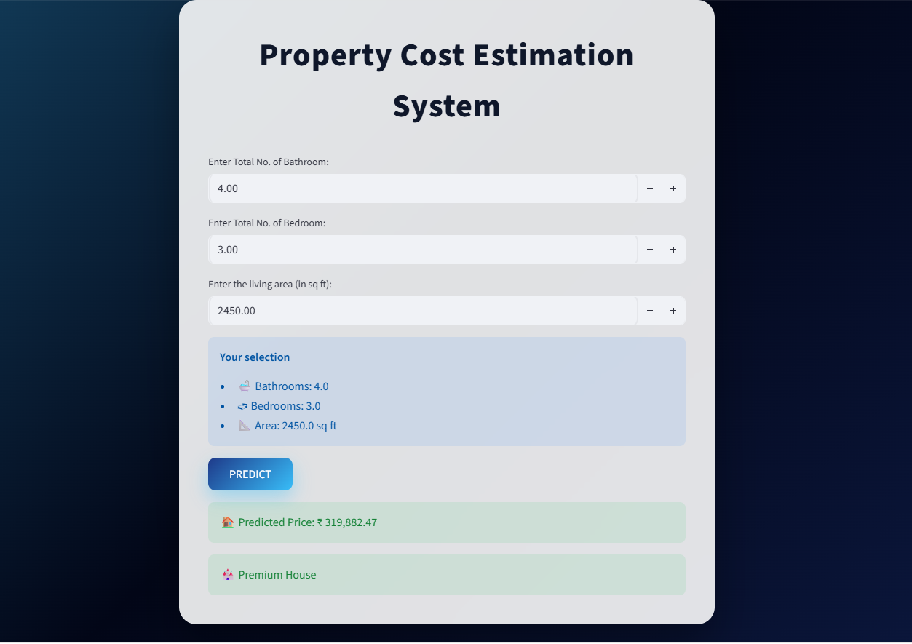

# 🏠 Property Cost Estimation System

A machine learning-powered web application that predicts house prices in real-time using **Linear Regression**, built with **Streamlit** for interactive deployment.



---

## 🚀 Live Demo

👉 **[Click here to try the app!](https://property-cost-estimator.streamlit.app/)**

---

## 📌 Project Overview

This project is an end-to-end machine learning application that estimates property prices based on key housing features:

- 🛁 Total number of bathrooms
- 🛏 Number of bedrooms  
- 📐 Living area size (sq ft)

The model classifies predictions into:
| Category | Price Range |
|----------|------------|
| 💰 Budget House | Below ₹1,50,000 |
| 🏡 Mid-range House | ₹1,50,000 – ₹3,00,000 |
| 🏰 Premium House | Above ₹3,00,000 |

---

## 🧠 ML Pipeline
Data Loading → Feature Selection → Data Cleaning →
Feature Engineering → Model Training → Evaluation →
Serialization → Streamlit Deployment

---

## ⚙️ Feature Engineering

A custom `TotalBathrooms` feature was engineered by combining:

```python
TotalBathrooms = FullBath + BsmtFullBath + 0.5*HalfBath + 0.5*BsmtHalfBath
```

This improves prediction quality by consolidating bathroom-related attributes into one meaningful variable.

---

## 🛠️ Tech Stack

| Technology | Purpose |
|-----------|---------|
| Python | Core programming language |
| Pandas | Data handling and preprocessing |
| NumPy | Numerical computations |
| Scikit-learn | Linear Regression model |
| Matplotlib | Data visualization |
| Pickle | Model serialization |
| Streamlit | Web application deployment |
| CSS | UI styling and animations |

---

## 📁 Project Structure

```
House-Price-Prediction/
│
├── app.py
├── House_Price_Prediction.ipynb
├── house_model.pkl
├── train.csv
├── requirements.txt
├── screenshot.png
└── README.md
```

---

## ▶️ How to Run Locally

### 1. Clone the repository
```bash
git clone https://github.com/Muthumari10/House-Price-Prediction.git
cd House-Price-Prediction
```

### 2. Install dependencies
```bash
pip install -r requirements.txt
```

### 3. Run the Streamlit app
```bash
streamlit run app.py
```

### 4. Open in browser
http://localhost:8501

---

## 📊 Model Performance

| Metric | Description |
|--------|-------------|
| **Algorithm** | Linear Regression |
| **Train/Test Split** | 80% / 20% |
| **Evaluation Metrics** | MSE, R² Score |
| **Dataset** | 1460 rows, Kaggle House Prices |

---

## 🎨 UI Features

- ✅ Animated gradient background
- ✅ Glassmorphism card design
- ✅ Interactive hover effects
- ✅ Live user selection preview
- ✅ Real-time price prediction
- ✅ Dynamic pricing classification

---

## 📸 Output Preview


---

## 🧾 Project Summary

> Developed a machine learning-based Property Cost Estimation System using Linear Regression for real-time house price prediction. Implemented feature engineering, data preprocessing, model evaluation, and deployed an interactive web application using Streamlit with custom CSS animations and glassmorphism UI design.

---

## 👩‍💻 Author

**Muthumari**  
[](https://github.com/Muthumari10)

---

## 📄 License

This project is licensed under the [MIT License](LICENSE).
